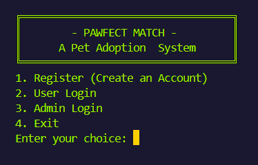
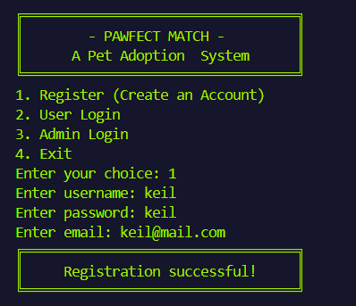
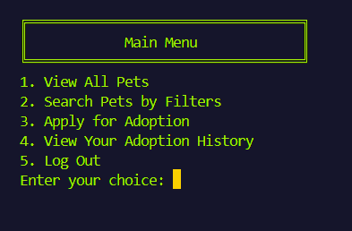
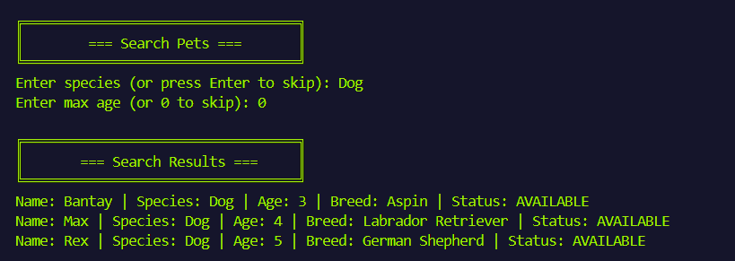
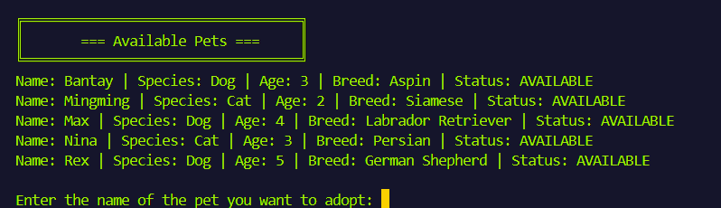
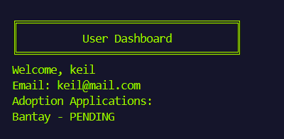
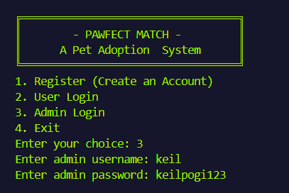
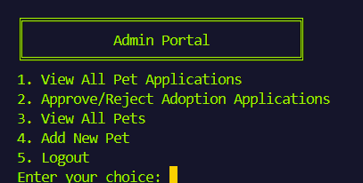
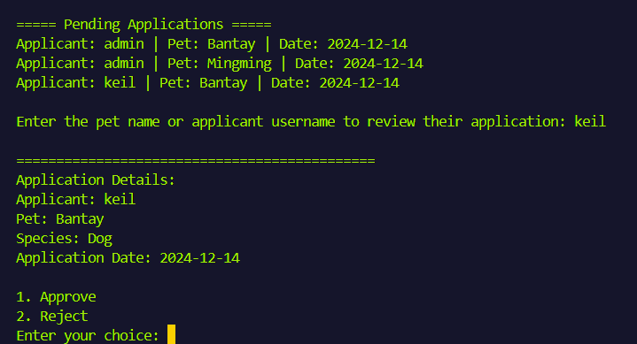

# 🐾 **Pawfect Match: A Pet Adoption System**
CS211 - Object-Oriented Programming

 


---
---

## **I. Project Overview** 🌟  

The *Pawfect Match: A Pet Adoption System* is a **Java-based application** developed to streamline the pet adoption process. Designed with simplicity in mind, the system provides an intuitive console interface for both potential adopters and administrators.  

### 💡 Features:
- 🐶 **Browse available pets**  
- 📝 **Apply for pet adoptions**  
- 📊 **Track adoption applications**  
- ⚙️ **Manage pets in the system**

---
---

## **II. Object-Oriented Programming (OOP) Principles** 🔧  

The project demonstrates key **OOP principles**:

### 1. 🏛️ **Inheritance**
- `User` is an abstract base class with `RegularUser` and `AdminUser` as subclasses.
- `Being` is an abstract base class for `Pet`.
- Subclasses inherit and extend functionality from their parent classes.

### 2. 🚪 **Abstraction**
- Abstract classes `Being` and `User` define common characteristics.
- Abstract methods like `displayDashboard()` enforce implementation in subclasses.
- `Authenticatable` interface provides a contract for authentication.

### 3. 🔒 **Encapsulation**
- Private fields in classes like `Pet` and `User`.
- Getter and setter methods control access to class attributes.
- Controlled modification of object states.

### 4. 🔄 **Polymorphism**
- Enum `AdoptionStatus` provides different states for pets.
- Overridden `toString()` method in `Pet` class.
- Different implementations of `displayDashboard()` for `RegularUser` and `AdminUser`.

---
---

## **III. Sustainable Development Goal (SDG) Integration** 🌍  

### 🐾 **SDG 15: Life on Land - Animal Welfare**  

The *Pawfect Match: A Pet Adoption System* supports **SDG 15** by:  
- 🏠 Facilitating **pet adoption** to provide homes for animals.  
- 🐕‍🦺 Tracking and managing pet welfare through the adoption process.  
- 🐾 Promoting **responsible pet ownership**.  
- 🛟 Encouraging the rescue and rehoming of animals.  

✨ By improving adoption rates, this system contributes to **halting biodiversity loss** and **promoting animal welfare**.  

---
---

## **IV. Running the Program** 🖥️  

### Prerequisites:  
- ☕ **Java Development Kit (JDK)** 8 or higher  
- 🛠️ **Java IDE** or command-line compiler (e.g., *Visual Studio Code*)  

### Steps to Run:
1. **Clone the Repository**  
   ```bash
   git clone https://github.com/keirzhr/Keil_Rizher_Valida-Java_OOP_Final_Project.git
   cd Pawfect_Match_PetAdoptionSystem


2. **Compile the Program**
   ```bash
   javac PawfectMatch.java
   ```

3. **Run the Application**
   ```bash
   java PawfectMatch
   ```

### Alternative Steps (Without Cloning)

1. **Download the Project Files**  
   - Download the project files from the repository or your source.  
   - Extract the files to a folder on your system, such as `Pawfect_Match_PetAdoptionSystem`.

2. **Navigate to the Project Folder**  

   Open a terminal or command prompt and navigate to the project directory:  
     ```bash
     cd Pawfect_Match_PetAdoptionSystem
     ```

3. **Compile the Program**  

   Run the `javac` command to compile the main program:  
   ```bash
   javac PawfectMatch.java

---
---

## V. Initial Login Credentials 🔑

#### Admin User
- 👤 Username: `keil`
- 🔒 Password: `keilpogi123`

### Main Menu Options

1. **Register**: Create a new user account
2. **User Login**: Access user-specific features
3. **Admin Login**: Access administrative functions
4. **Exit**: Close the application

## Additional Notes

- The system comes pre-seeded with some pets and an admin user
- Users can browse, search, and apply for pet adoptions
- Admins can add new pets, review, and manage adoption applications

---
---

## VI. Usage Guide 📖  

### **1. Initial Screen**  
  

**Options:**  
- 📝 **Register** (Create an Account)  
- 🔑 **User Login**  
- 🔒 **Admin Login**  
- ❌ **Exit**  

---

## **User Workflow** 👤  

### **1. Registration**  
  

- ✏️ Enter **username**  
- 🔒 Create **password**  
- 📧 Provide **email address**  

---

### **2. User Dashboard**  
  

**User Menu:**  
- 👀 **View All Pets**  
- 🔍 **Search Pets by Filters**  
- 📋 **Apply for Adoption**  
- 🗂️ **View Adoption History**  
- 🚪 **Log Out**  

---

### **3. Pet Search**  
  

**Filters:**  
- 🐾 Filter by **species**  
- ⏳ Filter by **maximum age**  
- 📜 View available pets matching criteria  

---

### **4. Adoption Application**  
  

**Steps:**  
1. Select a pet from the available list  
2. Submit the adoption application

---

### **5. View Adoption History**  
  

When viewing adoption history, the dashboard displays user-specific details, including pending or completed applications:

---
---

## **Admin Workflow** 🛠️  

### **1. Admin Login**  
  

- Use predefined **admin credentials**  

---

### **2. Admin Dashboard**  
  

**Admin Menu:**  
- 📄 **View All Pet Applications**  
- ✅ **Approve/Reject Adoption Applications**  
- 👀 **View All Pets**  
- ➕ **Add New Pet**  
- 🚪 **Logout**  

---

### **3. Application Review**  
  

**Steps:**  
1. Review **pending adoption applications**  
2. Approve or reject applications  
3. Update **pet adoption status**  

---
---

## VII. Acknowledgments 🙏

This project was developed as part of *CS 211 – Object-Oriented Programming* under the guidance of *Mr. Maurice Oliver Dela Cruz.* It reflects the application of OOP principles to solve real-world problems.

I deeply appreciate the opportunity to learn and apply these concepts, and I look forward to your valuable feedback to further improve this project.

---
---

## VIII. Contact 📫

- Developer: Keil Rizher R. Valida
- ✉️ Email: 23-02166@g.batstate-u.edu.ph
- 🌐 GitHub: [keirzhr](https://github.com/keirzhr)
